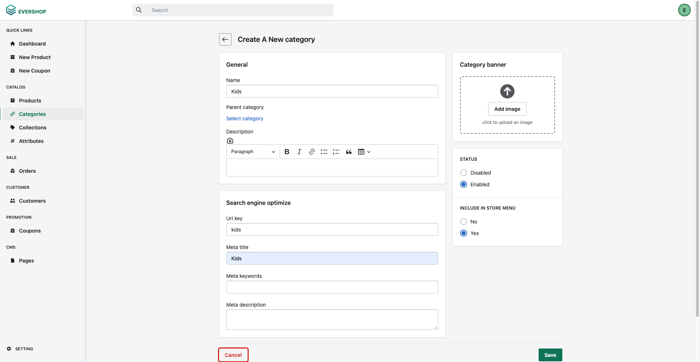
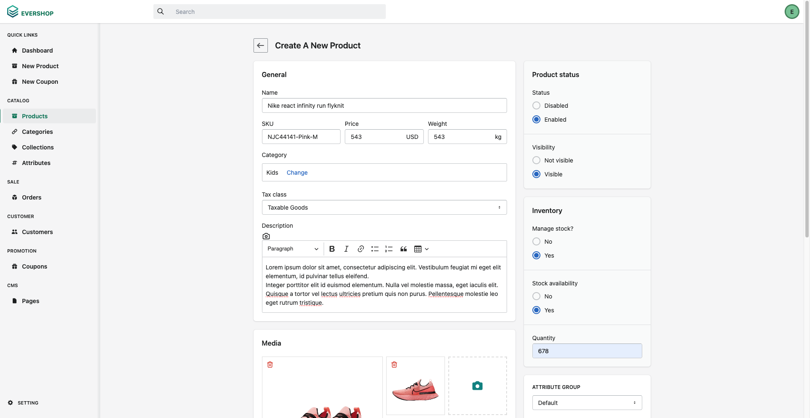
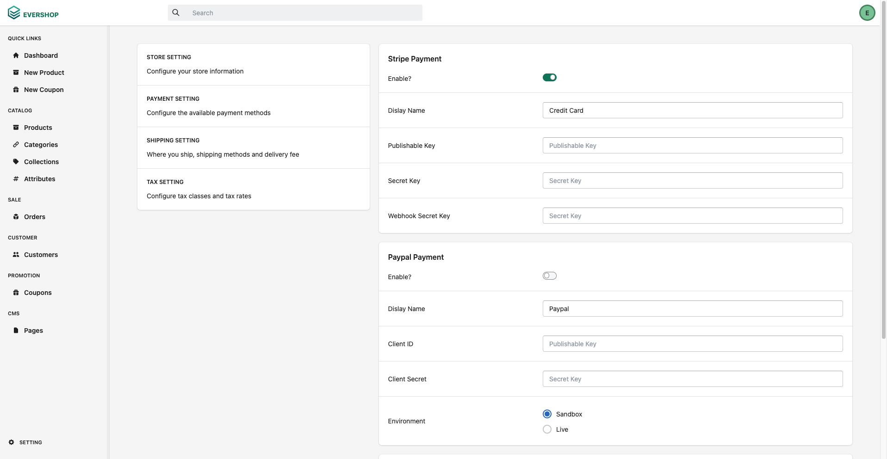
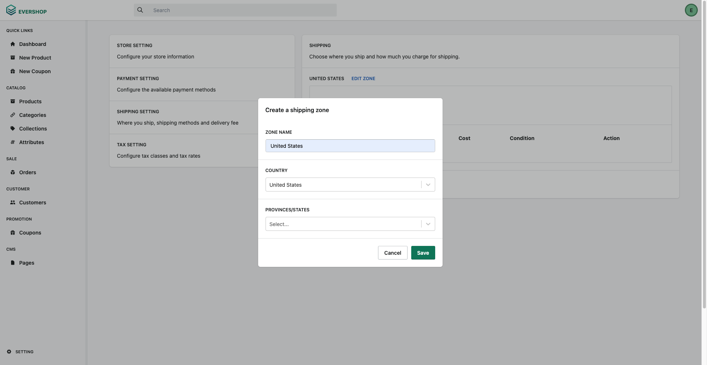
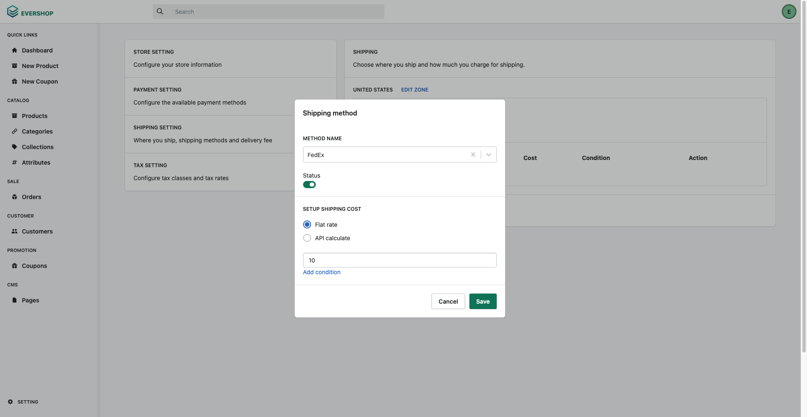
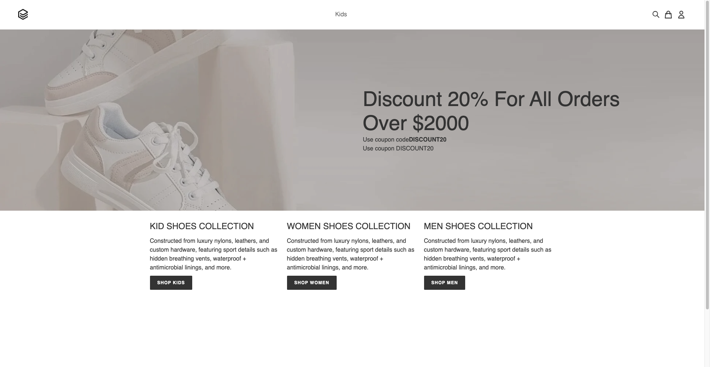

#  AI on IBM Z Model Integration with WMLz and EverShop Storefront (E-Commerce App)
This guide is part of the AI on [IBM Z Fraud Detection Solution Template](https://github.ibm.com/AIonZ/zST-fraud-detection).

We can use our deployed WMLz fraud detection AI model and integrate it into different types of applications. Guidance on integrating the AI model into a sample web based storefront is below. The AI model can be analyzed and/or provide inferencing APIs using a the sample AI on IBM Z Fraud Detection Dashboard.

The sample e-commerce application is based on the open source [EverShop Storefront](https://github.com/evershopcommerce/evershop) and has been extended to integrate with the AI on IBM Z Solution Template. EverShop is a GraphQL Based and React ecommerce platform with essential commerce features. Built with React, modular and fully customizable.
<p align="center">

</p>

# 

## Prerequisites
- Must have [AI on IBM Z Sample Fraud Detection Dashboard](https://github.ibm.com/AIonZ/zST-model-analysis) deployed for inferencing and analysis
- Must have docker installed

## Step 1 - Install & Deploy Sample E-Commerce Application
1. Change **app_url_w_port** in [CheckoutForm.jsx](https://github.com/evRivera/zST-storefront-evershop/blob/main/packages/evershop/src/components/frontStore/stripe/checkout/CheckoutForm.jsx) to your server IP and port (ip:port)
2. Run command in terminal:
    ```
    docker-compose up
    ```

## Step 2 - Configure Sample E-Commerce Application
### Access admin panel from web  browser
1. Enter URL in web browser using app url (e.g. localhost)
    ```
    http://localhost:3000/admin
    ```
2. Login with default admin credentials
    - email: admin@test.com
    - password: admin

### Add products
1. Create categories
    - Click **Categories** from the Catalog section
    - Click **New Category**
    - Add category details
        - Add name (e.g. Kids)
        - Add url key
        - Add meta title
        - Change status to **Enabled**
        - Change include in store menu to **Yes**
    - Click **Save**
    # 

2. Add products
    - Click **Products** from the Catalog section
    - Click **New Product**
    - Add category details
        - Make sure to change add category
        - Make sure to change status to **Enabled**
        - Make sure to change visibility to **Visible**
    # 

### Configure store settings
1. Click **Setting** on the bottom left
2. Click **Store Setting**

### Configure payment settings
1. Click **Setting** on the bottom left
2. Click **Payment Setting**
3. Enable **Stripe Payment**
4. Click **Save**
    # 

###  Configure shipping settings
1. Add shipping zone
    - Click **Setting** on the bottom left
    - Click **Shipping Setting**
    - Click **Create new shipping zone**
    - Add shipping details
    - Click **Save**
    # 

2. Add payment method
    - Click **Add Method**
    - Add **Method Name** (e.g. FedEx)
    - Enable status
    - Add flat rate (e.g. 10)
    - Click **Save**
    # 

## Step 3 - Access Sampe E-Commerce Application
1. Enter URL in web browser using app url (e.g. localhost)
    ```
    http://localhost:3000
    ```
    

## Step 4 - Use Fraud Detection AI Model with EverShop Storefront
1.  Make sure you have [AI on IBM Z Sample Fraud Detection Dashboard](https://github.ibm.com/AIonZ/zST-model-analysis) deployed for inferencing and analysis on the same local system
2. AI on IBM Z Sample Fraud Detection Dashboard is configured to invoke WMLz AI model
3. Add items to cart
4. Place order
    - Choose **Test failure** as payment method for fraud transaction example
    - Choose **Test success** as payment method for non fraud transaction example
    