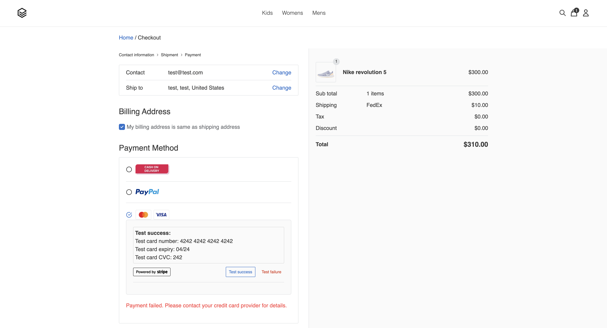

#  AI on IBM Z Model Integration with WMLz and EverShop Storefront (E-Commerce App)
This guide is part of the AI on [IBM Z Fraud Detection Solution Template](https://github.ibm.com/AIonZ/zST-fraud-detection).

We can use our deployed WMLz fraud detection AI model and integrate it into different types of applications. Guidance on integrating the AI model into a sample web based storefront is below. The AI model can be analyzed and/or provide inferencing APIs using a the sample AI on IBM Z Fraud Detection Dashboard.

The sample e-commerce application is based on the open source [EverShop Storefront](https://github.com/evershopcommerce/evershop) and has been extended to integrate with the AI on IBM Z Solution Template. EverShop is a GraphQL Based and React ecommerce platform with essential commerce features. Built with React, modular and fully customizable.
# 

## Prerequisites
- Must have [AI on IBM Z Sample Fraud Detection Dashboard](https://github.com/evRivera/zST-storefront-evershop) deployed for inferencing and analysis
- Must have [system requirements](https://evershop.io/docs/development/getting-started/system-requirements) that are provided in EverShop documentation

## Step 1 - Access Sample E-Commerce Application
1. Open terminal
2. Pull sample EverShop application code from GitHub
    ```
    git clone git@github.com:evRivera/zST-storefront-evershop.git
    ```
3. Navigate to home directory of GitHub repository in terminal
    ```
    cd zST-storefront-evershop/
    ```

## Step 2 - Setup Sampe E-Commerce Application
Follow the [EverShop installation guide](https://evershop.io/docs/development/getting-started/installation-guide)
<p align="center">

</p>

## Step 3 - Use Fraud Detection AI Model with EverShop Storefront
1.  Make sure you have [AI on IBM Z Sample Fraud Detection Dashboard](https://github.com/evRivera/zST-storefront-evershop) deployed for inferencing and analysis
2. AI on IBM Z Sample Fraud Detection Dashboard is configured to invoke WMLz AI model
3. Add items to cart
4. Place order
